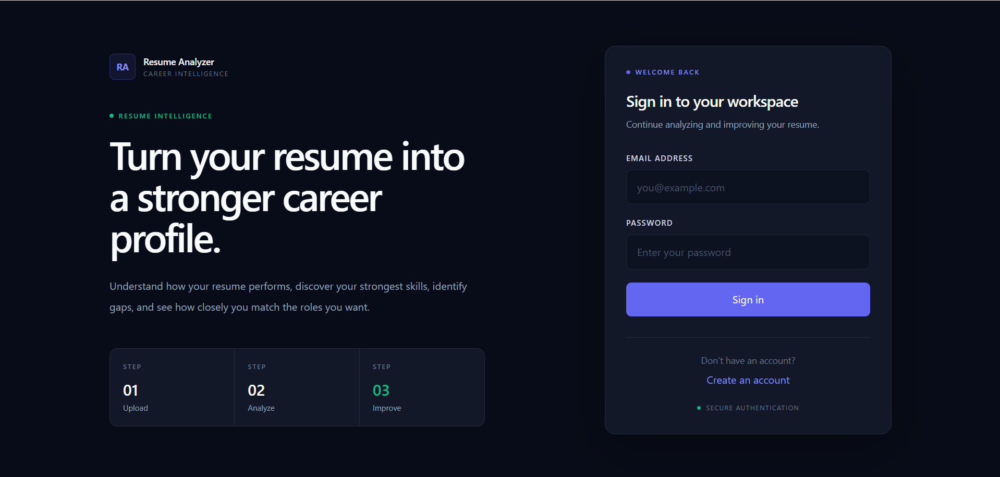
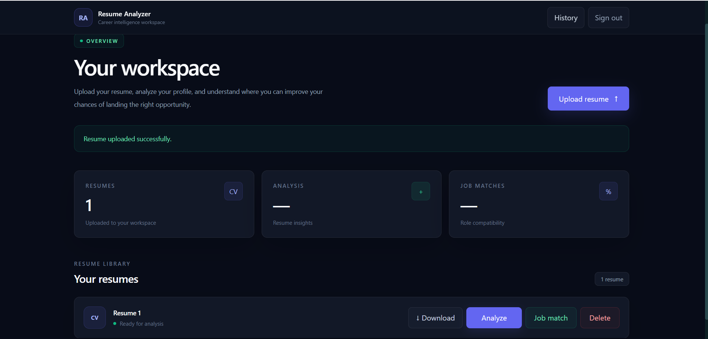
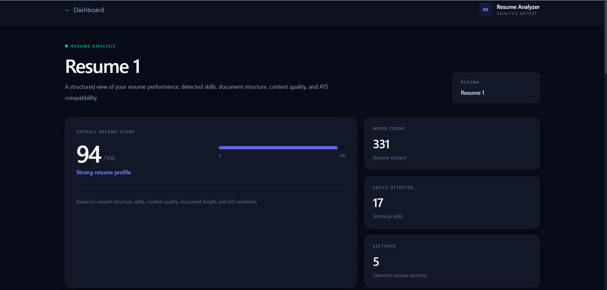
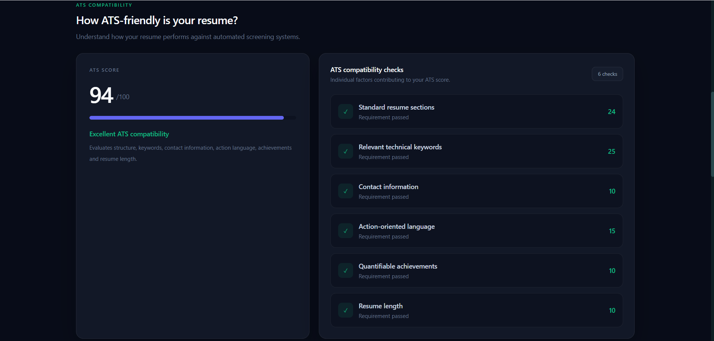
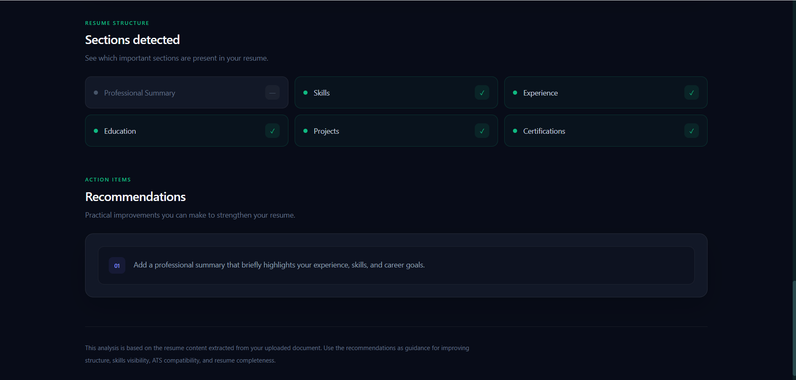
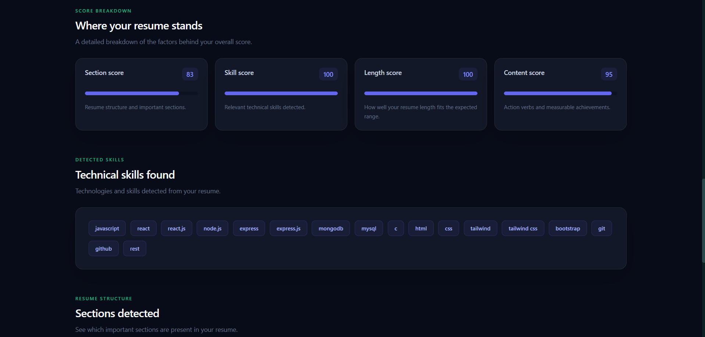
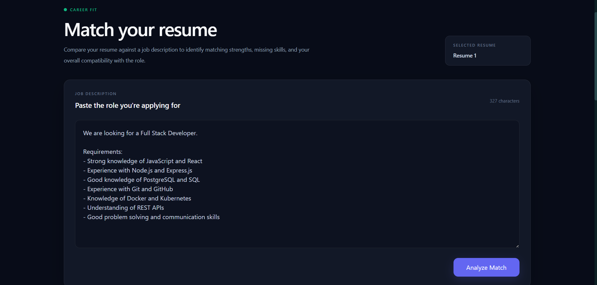
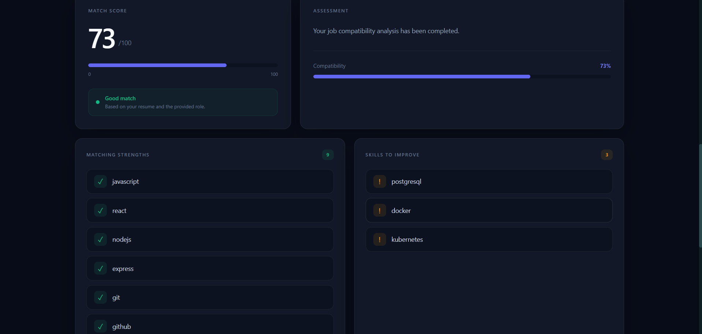
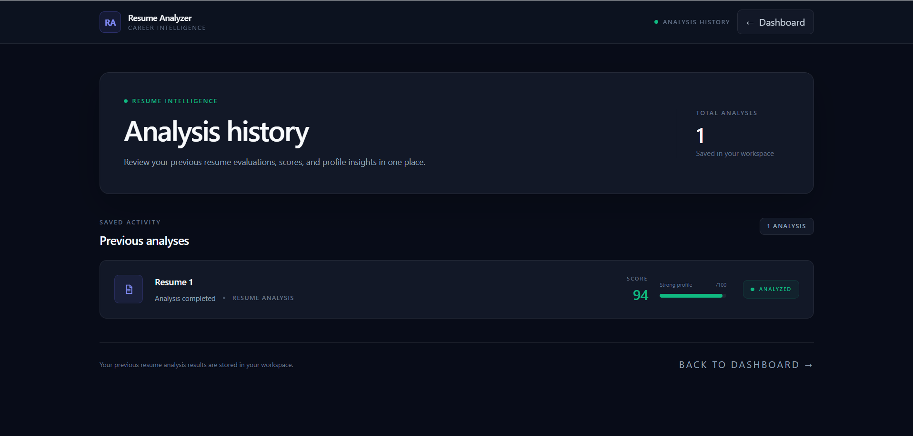

# 📄 Resume Analyzer

Resume Analyzer is a full-stack web application that helps users analyze and improve their resumes through resume scoring, ATS compatibility analysis, and job matching.

🌐 **Live Website:** https://resume-analyzer-2-c9vj.onrender.com
📂 **GitHub:** https://github.com/Unnati-1234/resume-analyzer

## 🚀 Features

* 🔐 User Registration & Login
* 📄 PDF & DOCX Resume Upload
* 📝 Resume Text Extraction
* 📊 Resume Scoring & Section Analysis
* 🎯 ATS Compatibility Analysis
* 💡 Strengths, Weaknesses & Recommendations
* 🎯 Resume–Job Description Matching
* 📜 Analysis History
* ⬇️ Resume Download & Delete

## 🛠 Tech Stack

**Frontend:** React, Vite, JavaScript, Tailwind CSS, React Context API

**Backend:** Node.js, Express.js, REST API, JWT, bcrypt, Multer

**Database:** PostgreSQL, Neon

**Resume Processing:** pdf-parse, Mammoth

**Deployment:** Render, Neon PostgreSQL

## 🏗 System Architecture

```text
React + Vite
      ↓
Express.js REST API
      ↓
PostgreSQL (Neon)
```

## 📊 Resume Analysis

The application analyzes:

* Resume sections
* Skills
* Word count
* Content quality
* Action verbs
* Quantifiable achievements
* Contact information
* ATS compatibility

It generates an overall score along with detailed scores, strengths, weaknesses, and recommendations.

## 🎯 Job Matching

Users can enter a job description and compare it with their resume.

* Matching skills
* Missing skills
* Skills to improve
* Job-match score

## 🔐 Security

* JWT-based authentication
* bcrypt password hashing
* Protected API routes
* User-specific data access
* Parameterized PostgreSQL queries
* Environment variables for sensitive configuration
* CORS configuration

## 🌍 Deployment

* **Frontend:** Render
* **Backend:** Render
* **Database:** Neon PostgreSQL
* **Production environment variables:** Configured securely

## 📸 Screenshots

### 🔐 Login


### 🏠 Dashboard


### 📤 Resume Upload


### 📄 Resume Analysis


### 📊 Resume Analysis Score


### 🔍 Resume Analysis Details


### 🎯 Job Matching


### 📈 Job Matching Results


### 📜 Analysis History

---

⭐ Feedback and suggestions are welcome!
